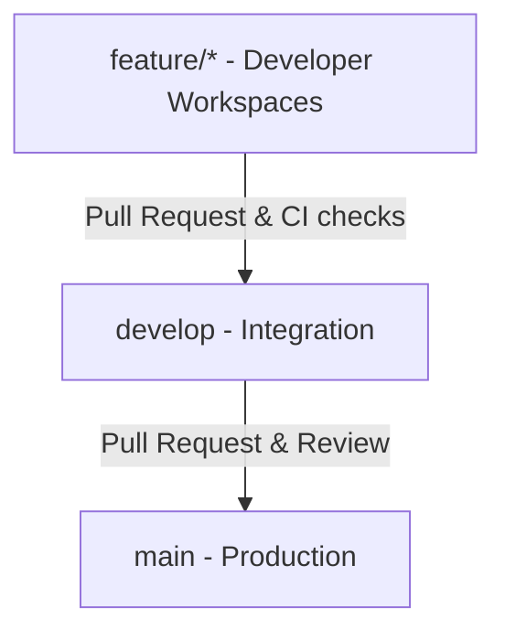
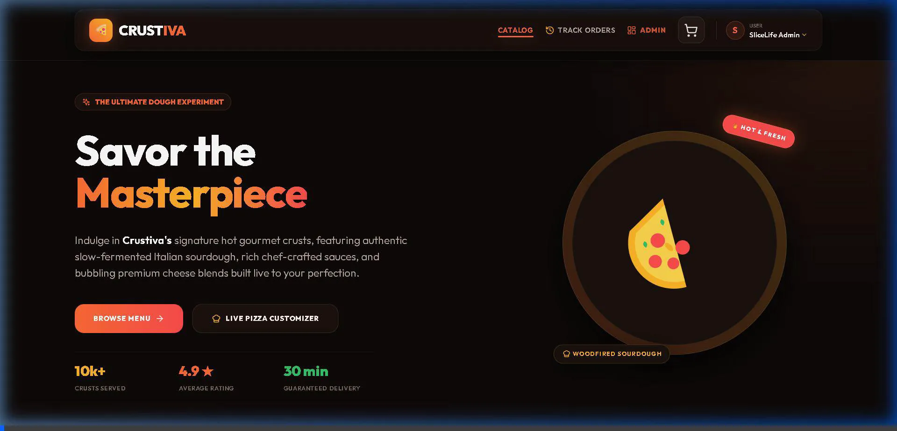

# 🍕 Crustiva | Premium Full-Stack MERN Pizza Delivery Application

A professional, production-grade full-stack Pizza Delivery Application built on the **MERN (MongoDB, Express, React, Node.js)** stack. This project serves as a cornerstone implementation for the **Oasis Infobyte Level 3 Developer Internship**.

---

## 🚀 Technology Stack

### Frontend Architecture
* **Core:** React + Vite (Fast compilation, hot module reloading)
* **Styling:** Tailwind CSS (Modern responsive utility system + premium design tokens)
* **Routing:** React Router v6 (Client-side nested routes and structural shells)
* **HTTP Client:** Axios (Configured with Vite reverse-proxy middleware)
* **Visual Tokens:** Lucide React (Crisp vector icons)

### Backend Architecture
* **Core:** Node.js + Express.js
* **Database:** MongoDB Atlas (Mongoose ODM layer)
* **Security & Auth:** JSON Web Tokens (JWT) + bcryptjs (Hashing & validation)
* **Email System:** Resend API Integration (Order receipt HTML formatting)
* **Payments:** Razorpay Test Mode SDK integration
* **Process Manager:** Nodemon (Hot-reloading daemon for dev)

### Deployment & CI/CD
* **Hosting:** Vercel (Frontend) + Render (Backend Web Service)
* **Pipelines:** GitHub Actions CI (Automated build and dependency checks)

---

## 🔑 Default Administrator Credentials & DB Seeding

When the MongoDB connection is established for the first time, our built-in `dbSeeder.js` automatically populates the database with essential stock, gourmet recipes, and a default administrative account.

### Administrative Login Details:
* **Admin Email:** `admin@crustiva.com`
* **Admin Password:** `adminpassword123`

### Pre-Seeded Catalog Items:
1. **5 Bases:** Thin Crust, Thick Crust, Gluten-Free Crust, Cheese Burst Crust, Flatbread
2. **5 Sauces:** Classic Marinara, Creamy Garlic Alfredo, Smoky Barbecue, Spicy Buffalo, Basil Pesto
3. **Cheeses:** Mozzarella, Parmesan, Cheddar, Ricotta, Vegan Cheese
4. **Veggies:** Sliced Mushrooms, Sweet Corn, Crisp Capsicum, Red Onions, Black Olives
5. **Meats:** Spicy Pepperoni, Smoked Chicken Tikka, Juicy Meatballs, Bacon Strips, Anchovies
6. **5 Gourmet Recipes:** Margherita Classic, Veggie Supreme, Meat Lovers Feast, Pesto Dream, Buffalo Firehouse

---

## 📂 Repository Structure

```text
Pizza Delivery Application/
├── .github/
│   └── workflows/
│       └── ci.yml             # GitHub Actions continuous integration pipeline
├── .vscode/
│   ├── extensions.json        # Recommended team extension setups
│   └── settings.json          # Workspace settings & formatting on save
├── docs/                      # Technical specification manuals
├── client/                    # React frontend application
│   ├── src/
│   │   ├── assets/            # Vector graphics, logos, and images
│   │   ├── components/        # Shared components (Navbar, Guards)
│   │   ├── context/           # React Context state providers (Auth, Cart)
│   │   ├── pages/             # Route pages (Home, PizzaCustomizer, CartPage, OrdersPage)
│   │   │   └── admin/         # Administrative views (Dashboard, Inventory, Orders)
│   │   ├── services/          # API integration files (Axios client)
│   │   ├── App.jsx            # Main app shell & router mapping
│   │   └── main.jsx           # ReactDOM browser mount point
│   ├── index.html             # Entry HTML document with Google Fonts imports
│   ├── vercel.json            # Vercel SPA rewrite configurations
│   └── vite.config.js         # Vite configuration with reverse proxy logic
├── server/                    # Express.js backend application
│   ├── src/
│   │   ├── config/            # Third-party setups (DB, dbSeeder)
│   │   ├── controllers/       # Controller handler callbacks (Auth, Order, Pizza, Inventory)
│   │   ├── middleware/        # JWT security & validation middleware
│   │   ├── models/            # MongoDB schema models (User, Order, Pizza, Inventory)
│   │   ├── routes/            # Express endpoint mappings
│   │   └── server.js          # App initialization and listener entry
│   ├── .env                   # Secret environmental keys (Git-ignored)
│   ├── .env.example           # Shared placeholder secrets template
│   └── package.json           # Node engine dependencies & scripts
├── .gitignore                 # Workspace version exclusions list
└── README.md                  # Development manual (This file)
```

---

## 🛠️ Step-by-Step Initial Setup

### 1. Verify Prerequisites
Before initializing the workspace, confirm you have Node.js and Git installed. Run the following in your terminal:
```bash
# Verify Node (v18+ recommended)
node -v

# Verify npm (v9+ recommended)
npm -v

# Verify Git
git --version
```

### 2. Configure Local Environment Files
Ensure keys are set up correctly. Copy backend placeholders:
```bash
cd server
cp .env.example .env
```
Open `server/.env` and update the local connections:
* `MONGO_URI`: Your MongoDB connection string (defaults to `mongodb://localhost:27017/pizza_db`).
* `JWT_SECRET`: Secret key used for signing JWT payloads.
* `RESEND_API_KEY`: API key for email delivery (or falls back to terminal logs during local testing).

### 3. Install Dependencies
Run the installation scripts in both workspaces:
```bash
# Install frontend packages
cd client
npm install

# Install backend packages
cd ../server
npm install
```

### 4. Start Development Servers
Start both environments concurrently:
```bash
# Terminal 1: Run the Backend server (listening on port 5000)
cd server
npm run dev

# Terminal 2: Run the Frontend client (listening on port 5173)
cd client
npm run dev
```

### 5. Verification Check
Open your browser and navigate to:
* **Frontend Site:** `http://localhost:5173`
* **Backend Health Route:** `http://localhost:5173/api/health` (automatically proxied directly to port 5000)

If the dashboard displays a green **"Successfully Connected"** badge, your environment is correctly configured!

---

## 🍕 Unique SaaS Features Built-In

### 1. Visual Customization Math
When choosing the customizer on any baseline gourmet pizza, the interface allows toggling bases, sauces, and toppings. If any ingredient stock level falls to `0` in MongoDB, the selection is automatically disabled in real time. Prices recalculate dynamically based on topping premiums.

### 2. Razorpay Signature Verification
Payments utilize the official Razorpay script loaded dynamically. Once processed in Test Mode, the client receives signature variables (`razorpay_payment_id`, `razorpay_order_id`, `razorpay_signature`) and cryptographically verifies them in the backend using Hmac SHA256 before finalizing the order.

### 3. Live Stepper Progress Polling
The order tracking dashboard contains a live progress stepper displaying:
`Order Received ➡️ In Kitchen ➡️ Sent To Delivery ➡️ Delivered`
Whenever active orders (non-delivered) exist, the client schedules an automatic **5-second polling task** that silencely queries the backend status, ensuring the screen reflects administrative changes instantly!

### 4. Automatic Stock Deduction & Low-Stock Alerts
Upon successful payment validation, the backend automatically:
1. Decrements stock counts in the `Inventory` collection for every crust base, sauce spread, cheese blend, and topping chosen in the order.
2. Evaluates remaining stock against safety `threshold` warnings.
3. If an ingredient dips below safety warning levels, an email notification is automatically dispatched to all registered admins using the **Resend API SDK** (with automatic terminal fallback loggers).

---

## ☁️ Cloud Production Deployment

### Frontend (Vercel)
Deploying the client-side SPA to Vercel is streamlined with the pre-configured `client/vercel.json` file.
1. Connect your repository to Vercel.
2. Set the **Root Directory** to `client`.
3. Configure the build settings:
   * Build Command: `npm run build`
   * Output Directory: `dist`
4. Deploy! Rewrites will automatically map client routes to `/index.html` to avoid 404s.

### Backend (Render)
1. Deploy the `server` directory to Render as a **Web Service**.
2. Add the environmental variables defined in your `server/.env` under the Service Settings tab.
3. Set the **Build Command** to `npm install` and the **Start Command** to `npm start`.

---

## 🔱 Professional Git Branching Workflow

We adhere to a strict trunk-based git schema.



### Typical Flow:
1. **Pull latest changes:**
   ```bash
   git checkout develop
   git pull origin develop
   ```
2. **Launch a dedicated feature branch:**
   ```bash
   git checkout -b feature/user-authentication
   ```
3. **Commit work with semantic conventions:**
   ```bash
   git add .
   git commit -m "feat(auth): integrate jwt sign token validation and register controllers"
   ```
4. **Push and create a Pull Request (PR) to `develop`:**
   ```bash
   git push origin feature/user-authentication
   ```

---

## ⚠️ Troubleshooting Guide

### 1. Port 5000 / 5173 Conflicts
If you receive an `EADDRINUSE: address already in use :::5000` error:
* **Windows (PowerShell):**
  ```powershell
  Get-Process -Id (Get-NetTCPConnection -LocalPort 5000).OwningProcess | Stop-Process -Force
  ```
* **macOS / Linux:**
  ```bash
  kill -9 $(lsof -t -i:5000)
  ```

### 2. Vite CORS / Proxy Errors
If the health check fails to reach the backend:
1. Double-check that your Express server is actively running on port `5000`.
2. Review `client/vite.config.js` to ensure the proxy block targets `http://localhost:5000` exactly.
3. Restart the Vite developer daemon (`Ctrl + C` then `npm run dev`).

---

## 📸 Production UI/UX Walkthrough & Screenshots

Here is a visual showcase of the elite **CRUSTIVA Dark Gourmet Theme** and custom MERN interactive elements in action.

### 1. Immersive Hero Landing & Chef Specials
A floating glassmorphic hero deck welcomes gourmands with premium Outfit-font typography, smooth Framer Motion CTA animations, and a rich, warm black `#0F0B0A` background.



### 2. Premium Recipe & Ingredient Cards
Hover-active interactive product cards display reviews (`⭐ 4.8`), real-time preparation times, visual veggie/meat pills, and specific ingredient chips.


### 3. Layered Sourdough Pizza Customizer
A completely live virtual pizza builder with animated scaling base dough, spring-expanding custom sauces & cheeses, and bounce-bounce coordinates that drop veggies/meats precisely onto random scatter points.


