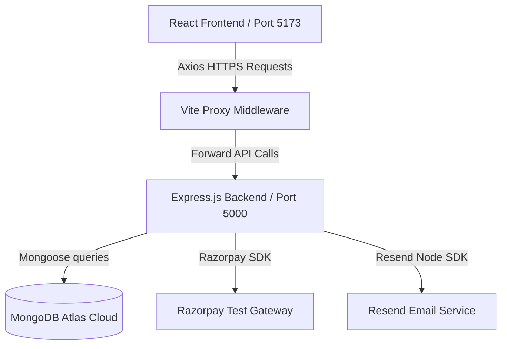

# 📐 SliceLife Architectural Specification Manual

This document outlines the software design patterns, architectural choices, data models, and integration protocols chosen for the **SliceLife Premium Pizza Delivery MERN Application**.

---

## 🏛️ Architectural Overview

We employ a decoupled **Single Page Application (SPA)** client architecture linked to a modular **RESTful API Web Service** using the MERN stack.

### Key Architectural Guidelines
1. **Separation of Concerns:** Frontend contains pure user presentation, layout shells, and lightweight state hooks. Backend handles cryptographic hashing, JWT verification, authorization policies, database transactions, and integration adapters.
2. **Reverse Proxying:** Rather than hardcoding full URLs in the React client, Axios calls local endpoints (e.g. `/api/health`). The Vite server proxies these directly to the backend. This standardizes local routing, mitigates CORS configuration hurdles, and simplifies production environment setups.
3. **Fail-Safe Connections:** Backend services boot successfully even if external resources (such as MongoDB Atlas) are temporarily offline, warning in console and recovering automatically upon request triggers.

---

## 📂 Frontend Directory Modules (`client/`)

* **`src/assets/`:** Contains static visual tokens and vectors (logos, banners, custom topping graphics).
* **`src/components/`:** Houses lightweight, reusable atomic units (e.g. `Button.jsx`, `Modal.jsx`, `PizzaCard.jsx`, `Input.jsx`).
* **`src/context/`:** Houses React Context Providers to maintain global state.
  * `AuthContext.jsx` — Tracks login credentials, active user profile, and JWT token state.
  * `CartContext.jsx` — Maintains active shopping cart lists, quantities, and topping customization states.
* **`src/pages/`:** Major route pages mapped to the React Router shell:
  * `Home.jsx` — Visual landing area, customer testimonials, and promotion carousels.
  * `Menu.jsx` — Dynamic grid showing pizzas categorized by type (Veg, Non-Veg, Gourmet).
  * `PizzaCustomizer.jsx` — Visual drag-and-drop or checklist engine to add extra cheese, premium meats, or fresh vegetables.
  * `Checkout.jsx` — Cart summary and Razorpay payment triggers.
  * `AdminDashboard.jsx` — Admin control panels to view incoming orders and toggle preparation statuses.
* **`src/router/`:** Centralized router declarations, nested layouts, and Route Guards (Private Routes for customers, Admin-only overrides).
* **`src/services/`:** Axiom client instances. Abstracted network functions linked to remote API routes (e.g., `authService.js`, `pizzaService.js`, `orderService.js`).

---

## 📂 Backend Directory Modules (`server/`)

* **`src/config/`:** Houses configuration scripts that bootstrap external services:
  * `db.js` — MongoDB Mongoose connection and connection pool tuning.
  * `razorpay.js` — Razorpay client SDK loading using keys.
  * `resend.js` — Resend SDK client configuration.
* **`src/controllers/`:** Controller callback suites executing the core business logic (e.g., `authController.js`, `orderController.js`, `pizzaController.js`).
* **`src/middleware/`:** Scalable hook points processing HTTP packages:
  * `authMiddleware.js` — Checks incoming Authorization headers, unpacks bearer tokens, verifies signatures with `JWT_SECRET`, and mounts users on request objects (`req.user`).
  * `errorMiddleware.js` — Catches uncaught Express controller errors, formats responsive JSON payloads, and hides production trace blocks.
* **`src/models/`:** Strict schemas mapping document models into MongoDB:
  * `User.js` — Credentials, names, billing addresses, and system roles (Customer vs Admin).
  * `Pizza.js` — Pizza names, baseline pricing, size scales, topping matrices, and graphic references.
  * `Order.js` — Cart items, order amounts, payment tracking IDs, client details, coordinates, and real-time preparation states (`Placed`, `Baking`, `Out for Delivery`, `Delivered`).
* **`src/routes/`:** Maps sub-routers to individual resource groups (e.g. `/api/auth`, `/api/pizzas`, `/api/orders`).

---

## 🔐 Security & Integration Pipelines

### 1. User Authentication
Passwords are encrypted using **bcryptjs** utilizing a workload factor of `10` rounds before database insertion. Session tokens are signed using high-entropy keys (`JWT_SECRET`) and issued with an expiration duration (defaulting to 7 days).

### 2. Payments (Razorpay Test Mode)
* Client requests order generation via `/api/orders`.
* Server contacts Razorpay using keys, receives a unique `order_id`, logs the transaction, and returns it.
* Client initiates Razorpay Checkouts modal in browser.
* Upon customer clearance, Razorpay generates cryptographic payment parameters (`razorpay_payment_id`, `razorpay_signature`).
* Server validates signature integrity before marking order documents as `Paid`.

### 3. Transaction Notifications (Resend API)
Once order validations succeed:
* Express server compiles responsive HTML order templates.
* The backend sends transaction receipts and confirmation codes to customer emails via the **Resend API SDK** to bypass SMTP blocks.
